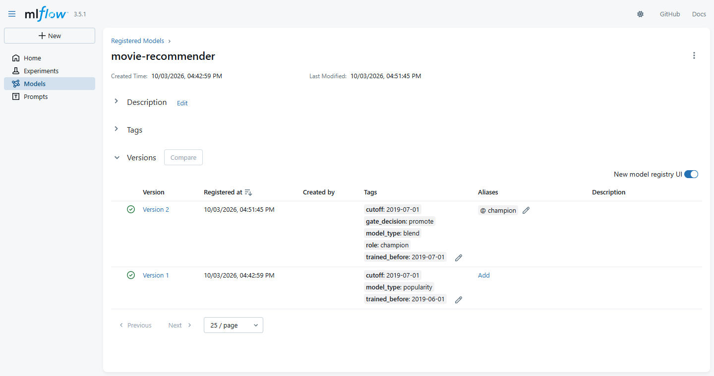
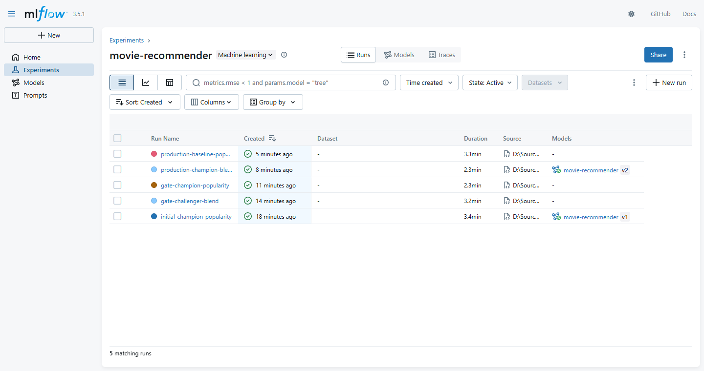

# Movie Recommender MLOps Pipeline

Recommend ten movies a user is likely to enjoy next, with a model that is retrained for each new month and replaces the current one only when it is measurably better.

Experiment and model registry: [MLflow on DagsHub](https://dagshub.com/thanhtan2210/Big-Data-MLOps-System.mlflow/#/experiments/1)



> The previous RAG version of this repo lives on branch `archive/before-cleanup`.

## Problem → Approach → Results

**Problem.** A streaming-style catalogue needs a "what to watch next" list per user, and the model behind it has to be refreshed as new ratings arrive without silently getting worse.

**Approach.** MovieLens 25M, split by time. The model is a truncated SVD of the user × movie "liked" matrix blended with recent popularity; the baseline is recent popularity alone. One command runs a monthly cycle: prepare the data, compare challenger and champion on the last 30 days of training data (the gate), promote only if the challenger is better with 95% confidence, refit the winner, register it in MLflow, and score it on the following 30 days. The champion is served by a small API in a Docker image.

**Results.** On July 2019, a month no modelling decision had looked at, the model reaches HitRate@10 27.7% against 22.4% for popularity and NDCG@10 0.0831 against 0.0711 (paired difference +0.0121, 95% interval [+0.0044, +0.0193], 1,475 users). The API answers a recommendation request in under 5 ms (median, measured from the client).

## Results

Intervals are 95% bootstrap intervals over users (1,000 resamples); differences are paired (the same resampled users for both recommenders). Produced by `python -m src.pipeline --cutoff 2019-07-01`; files in [reports/2019-07-01/](reports/2019-07-01/).

### Production window: July 2019 (independent)

Models fitted on ratings before 2019-07-01, scored on the 9,880 liked ratings of 1,475 users from 2019-07-01 to 2019-07-30 - [production.json](reports/2019-07-01/production.json):

| | Champion (blend, registry version 2) | Popularity | Champion − Popularity (paired) |
| --- | --- | --- | --- |
| HitRate@10 | **27.7%** [25.4, 30.1] | 22.4% [20.3, 24.5] | +5.2 pt [+3.1, +7.3] |
| Recall@10 | **10.5%** [9.3, 11.7] | 8.9% [7.8, 10.0] | +1.6 pt [+0.6, +2.7] |
| NDCG@10 | **0.0831** [0.0740, 0.0920] | 0.0711 [0.0628, 0.0804] | +0.0121 [+0.0044, +0.0193] |
| Catalogue coverage | 3.4% (439 movies) | 1.7% (220 movies) | +1.7 pt |
| Long-tail share | 26.5% [25.0, 27.9] | 17.2% [16.8, 17.6] | +9.3 pt [+7.8, +10.8] |

This is the first evaluation that no choice of model or parameter has touched: the parameters were frozen before July was read.

### Promotion gate for cutoff 2019-07-01

Gate window 2019-06-01 to 2019-06-30 (9,727 liked ratings of 1,407 users); both models fitted on ratings before 2019-06-01 - [gate.json](reports/2019-07-01/gate.json):

| | Challenger (blend) | Champion (popularity, registry version 1) | Challenger − Champion (paired) |
| --- | --- | --- | --- |
| HitRate@10 | 27.2% [24.7, 29.4] | 22.8% [20.5, 25.0] | +4.4 pt [+2.0, +6.5] |
| Recall@10 | 11.3% [10.1, 12.5] | 9.1% [7.9, 10.2] | +2.3 pt [+1.1, +3.5] |
| NDCG@10 | 0.0846 [0.0749, 0.0937] | 0.0674 [0.0589, 0.0751] | **+0.0172 [+0.0084, +0.0260]** |

Rule: promote the challenger if the lower bound of the 95% interval of the NDCG@10 difference is above 0. Decision: **promote** (lower bound +0.0084). The registry was empty, so popularity had first been registered as the initial champion.

This gate is not independent evidence: its window, June 2019, is the month that served as the test set while the model was being chosen (see the appendix), which is why its numbers equal that test table. The July production window above is the independent check.



### API latency

The champion (version 2: 160,199 users, 12,930 movies) served from the Docker image on the same machine, sequential requests over one connection, measured from the client after 20 warm-up requests - `python -m scripts.benchmark_api`, [api_latency.json](reports/api_latency.json):

| Request | Requests | p50 | p95 | p99 |
| --- | --- | --- | --- | --- |
| `GET /recommend/{user_id}` (random real users, seed 42; 11 `personalized`, 189 `popularity_fallback`) | 200 | 4.4 ms | 5.5 ms | 7.3 ms |
| `POST /recommend` (5-20 random liked movies; all `personalized`) | 50 | 4.5 ms | 5.7 ms | 6.0 ms |

Machine: Windows 11, Intel x86-64 with 8 logical CPUs, 15.9 GB RAM, Docker Desktop. No concurrent load was applied. Two things changed the numbers during measurement and are fixed or recorded: the container is pinned to one linear-algebra thread (with one thread per core the same requests were several times slower), and requests go to `127.0.0.1` (through the host name `localhost`, Docker Desktop's loopback proxy adds about 43 ms to each POST: median 47.7 ms).

The image is 1.41 GB, most of it the Python packages; the model state is 40 MB.

## How it works

```text
MovieLens (R2: raw/) → prepare → R2: processed/<cutoff>/ → gate: challenger vs champion → refit winner → MLflow registry (alias champion) → score on the next 30 days
                                                                                                        ↓
                                                                    export champion → Docker image → API: /recommend
```

| Component | Role |
| --- | --- |
| pandas + PyArrow | Time-based split and train-only filters; byte-identical parquet output per cutoff |
| scikit-learn + SciPy | Truncated SVD on a sparse user × movie matrix |
| MLflow on DagsHub | Runs (parameters, metrics with interval bounds, pyfunc model), model registry, `champion` alias |
| Cloudflare R2 | Raw data and prepared data per cutoff |
| FastAPI + Docker | Three endpoints serving the champion; the model is copied into the image, so the container holds no credentials |
| pytest + GitHub Actions | Unit and end-to-end tests on synthetic data, and a Docker build with a smoke test, all without network access or credentials |

Not built yet: a loop over several months.

**Retraining and the promotion gate are two different things:**

| | What it does | Status |
| --- | --- | --- |
| Scheduled retraining | Each cutoff, the champion's model type is refitted on all ratings before the cutoff and registered as a new version | Built (step 4 of the pipeline) |
| Gate for a new configuration | A challenger with a different model or configuration must beat the champion on the last 30 days, with the lower bound of the 95% interval above 0, before it replaces it | Built (steps 2-3); so far only used for blend against popularity |
| Look-back evaluation | Each month's champion scored on the following month, over several months, to see whether retraining keeps the model ahead of popularity | Planned (stage 6) |

**Data** (`src/prepare.py`). For a cutoff date (midnight UTC): train = every rating before the cutoff, for movies with at least 50 ratings in train; evaluation window = liked ratings (rating ≥ 4.0) in the 30 days after the cutoff, for users with at least 5 liked movies in train and movies in the training catalogue. Every filter is computed on the training set only. Parameters: [configs/data.yaml](configs/data.yaml). Running the same cutoff again gives byte-identical parquet files; an upload to R2 never overwrites different content.

**Model** (`src/model.py`). `score(user, movie) = z(SVD score of the user) + 4 × z(log(1 + likes in the last 90 days))`, with a rank-64 SVD fitted on the liked ratings of the last year. Movies a user already rated are never recommended; a user unknown to the training data gets the popularity list. The parameters in [configs/train.yaml](configs/train.yaml) are frozen.

**Baseline** (`src/baseline.py`). The movies with the most liked ratings in the last 90 days of training. Nothing to tune.

**Tracking** (`src/tracking.py`). By default every script writes only to the machine it runs on: MLflow runs go to a local `mlflow.db` and nothing is uploaded to R2. `--remote` is required to log to DagsHub and to upload to R2, and each script prints where it will write before it starts. Only registered runs upload the model; evaluation-only runs log parameters and metrics.

**API** (`src/api.py`). `GET /health`; `GET /recommend/{user_id}?n=10`; `POST /recommend` with the movies an anonymous user liked, who is folded into the model with the same scoring. Each answer carries a `strategy`: `personalized` when the model has liked ratings of the user inside its one-year window (or usable liked ids in a POST), `popularity_fallback` otherwise. Requests are validated (1 ≤ n ≤ 50, at most 100 liked ids), and each one writes a JSON log line (time, endpoint, strategy, n, latency) to stdout.

## How to run

Python 3.13.

```bash
pip install -r requirements.txt
python -m pytest -q
python -m src.pipeline --cutoff 2019-07-01    # prepare, gate, refit, register, score the next 30 days (local MLflow)

python -m src.export_champion --remote        # download the champion from DagsHub into serving_model/
docker build -t movie-rec .
docker run -p 8000:8000 movie-rec
```

```bash
# a user with recent likes (an unknown id, or a user without recent likes, gets the popularity list)
curl "http://127.0.0.1:8000/recommend/14722?n=10"

# an anonymous user who liked The Godfather, Pulp Fiction, The Shawshank Redemption, Casablanca and 2001
curl -X POST "http://127.0.0.1:8000/recommend" -H "Content-Type: application/json" \
     -d '{"liked_movie_ids": [858, 296, 318, 912, 924], "n": 10}'
```

Credentials for R2 and DagsHub go in a `.env` file ([.env.example](.env.example)); they are only used with `--remote` (or to read the raw data from R2). Without R2, add `--source local:<directory with ratings.csv and movies.csv>` to the pipeline. `python -m src.export_champion` without `--remote` exports the champion of the local MLflow store. The steps can also be run one at a time: `python -m src.prepare --cutoff <date> [--remote]`, `python -m src.train --cutoff <date>`, `python -m src.evaluate --cutoff <date>`.

## Limitations

- **One independent month so far.** July 2019 is the only window untouched by model selection; August-October have not been run.
- **The first gate reused a month already seen** during model selection (June 2019).
- **New users are not evaluated.** Every evaluated user has at least 5 liked movies before the cutoff; in June 2019 most liked ratings came from users without that history.
- **Accuracy costs variety.** The champion recommends 439 distinct movies across 1,475 users; plain SVD covered about twice as many in the June test.
- **Offline metrics on ratings**, which are not viewing behaviour and do not replace an online test.
- **A gate between identical models is a no-op.** Once the champion is the blend, the challenger has the same type and frozen parameters, so later gates only confirm and refit it until a different challenger exists.
- **Most known users get the popularity fallback.** The model only uses liked ratings of the last year: 11,567 of the 160,199 users in the training data (7.2%, counted by `scripts/benchmark_api.py` in [api_latency.json](reports/api_latency.json)) have one and get `personalized` recommendations. The others receive the recent-popularity list minus the movies they already rated, and the API says so (`popularity_fallback`).
- **Latency was measured without concurrent load**, on one laptop, with client and container on the same machine.
- **Results depend slightly on the environment.** The reports in `reports/2019-06-01/` and `reports/2019-07-01/` were produced on Python 3.11 with NumPy 1.26. On the current pins (Python 3.13, NumPy 2.5) the prepared data is byte-identical, but retraining at cutoff 2019-06-01 gives NDCG@10 0.08467 instead of 0.08463: a different linear-algebra library changes a few near-ties.

## Appendix: how the model was chosen (cutoff 2019-06-01)

The files in [reports/2019-06-01/](reports/2019-06-01/) are a historical record. They were produced by the selection scripts of commits `60d138c` and `cd96837` (a k sweep in `src/train.py`, `src/diagnose.py`, `src/blend.py`), since replaced by the single model with frozen parameters. The current code reproduces the blend and popularity rows of the June test table exactly.

Train: ratings before 2019-06-01. Test: the 9,727 liked ratings of 1,407 users in June 2019.

**The recommenders**

- **PureSVD**: a truncated SVD of the binary user × movie matrix (1 where the rating is at least 4.0). Only the movie factors are stored; a user is scored from the movies they liked. Movies a user already rated are never recommended.
- **Popularity** (baseline): the movies with the most liked ratings in the last 90 days of training. No parameter to tune.
- **PureSVD + recent popularity**: `score = z(SVD score of the user) + weight × z(log(1 + likes in the last 90 days))`, with the SVD fitted on a recent window of training ratings (`train_window`).

**Test set (June 2019)** - [test_metrics_v2.json](reports/2019-06-01/test_metrics_v2.json):

| | PureSVD (k = 64) | PureSVD + recent popularity (1 year, weight 4) | Popularity | Blend − Popularity (paired) |
| --- | --- | --- | --- | --- |
| HitRate@10 | 21.6% [19.6, 23.7] | **27.2%** [24.7, 29.4] | 22.8% [20.5, 25.0] | +4.4 pt [+2.0, +6.5] |
| Recall@10 | 7.4% [6.5, 8.3] | **11.3%** [10.1, 12.5] | 9.1% [7.9, 10.2] | +2.3 pt [+1.1, +3.5] |
| NDCG@10 | 0.0596 [0.0524, 0.0662] | **0.0846** [0.0749, 0.0937] | 0.0674 [0.0589, 0.0751] | +0.0172 [+0.0084, +0.0260] |
| Catalogue coverage | 7.1% (920 movies) | 3.3% (430 movies) | 1.5% (195 movies) | +1.8 pt |
| Long-tail share | 0.2% [0.1, 0.3] | 28.2% [26.6, 29.7] | 17.7% [17.2, 18.2] | +10.5 pt [+9.0, +12.1] |

**How to read this table.** The blend was selected on the May validation window; the June test window has now been looked at twice (first for plain PureSVD, then for the blend). The blend's test numbers are therefore optimistic to an unknown degree. The independent evaluation is the July production window reported at the top of this README; August-October remain untouched.

### Selection steps

1. **k** - `python -m src.train`, [validation.csv](reports/2019-06-01/validation.csv). On the validation window (liked ratings in May 2019, model fitted on ratings before 2019-05-01, 1,489 users) k = 64 had the highest NDCG@10 (0.0624), with intervals overlapping those of k = 32, 128 and 256: k matters little.

2. **First test evaluation** - `python -m src.evaluate`, [test_metrics.json](reports/2019-06-01/test_metrics.json). Plain PureSVD did not beat popularity: NDCG@10 0.0596 against 0.0674, Recall@10 lower by 1.7 points [−3.0, −0.3].

3. **Diagnostics** - `python -m src.diagnose`, [diagnostics.json](reports/2019-06-01/diagnostics.json). PureSVD has no notion of time, and what users like in the test month leans towards recent releases:

   | | Released 2018 or later | Median release year |
   | --- | --- | --- |
   | Liked ratings in train, all time | 0.2% | 1996 |
   | Liked ratings in train, last 90 days | 5.5% | 2004 |
   | Movies liked in the test window | 12.2% | 2007 |
   | PureSVD top-10 | 0.1% | 2002 |
   | Popularity top-10 | 22.7% | 2006 |

   | Target movies | Users | PureSVD HitRate@10 | Popularity HitRate@10 |
   | --- | --- | --- | --- |
   | Released 2018 or later | 614 | 0.3% [0.0, 0.8] | 28.5% [24.9, 31.8] |
   | Released before 2018 | 1,220 | 24.8% [22.5, 27.3] | 14.0% [12.1, 16.0] |

   PureSVD is the better recommender for older movies and almost never finds a new one. The popularity baseline's long-tail share (17.7%) also comes from new releases, which have few ratings in total: without movies from 2018 onwards it is 0.3%.

4. **Blend** - `python -m src.blend`, [validation_blend.csv](reports/2019-06-01/validation_blend.csv). Grid of `train_window` ∈ {all, 3 years, 1 year} × weight ∈ {0, 0.25, 0.5, 1, 2, 4} with k = 64, scored on the same validation window. Best weight per window:

   | train_window | weight | HitRate@10 | Recall@10 | NDCG@10 | Coverage |
   | --- | --- | --- | --- | --- | --- |
   | all | 4 | 23.2% | 8.3% | 0.0673 [0.0594, 0.0758] | 3.1% |
   | 3 years | 4 | 24.7% | 8.9% | 0.0729 [0.0648, 0.0816] | 3.4% |
   | **1 year** | **4** | 26.5% | 10.1% | **0.0791** [0.0704, 0.0881] | 3.4% |
   | Popularity | - | 22.1% | 8.4% | 0.0667 [0.0585, 0.0745] | 1.5% |

   The selected configuration beats popularity on validation by 0.0124 NDCG@10 [+0.0039, +0.0214]. Two things to note. The training window does most of the work: with weight 0, NDCG@10 is 0.0624 for all of train, 0.0661 for 3 years and 0.0682 for 1 year. And the best weight is the largest one in the grid for every window, so the optimum may lie beyond it; no weight outside the grid was tried.

### Accuracy against variety

Test set, `train_window` = 1 year - [tradeoff.csv](reports/2019-06-01/tradeoff.csv). Descriptive only: the weight was chosen on validation, not from this table.

| Weight | NDCG@10 | HitRate@10 | Catalogue coverage |
| --- | --- | --- | --- |
| 0 | 0.0741 | 24.0% | 6.7% |
| 0.25 | 0.0803 | 26.5% | 5.1% |
| 0.5 | 0.0812 | 26.9% | 4.9% |
| 1 | 0.0814 | 27.0% | 4.5% |
| 2 | 0.0824 | 27.1% | 4.0% |
| 4 | 0.0846 | 27.2% | 3.3% |

More weight on recent popularity buys a little accuracy and costs variety: from weight 0 to 4 the number of distinct movies recommended is halved.

### Limits of this evaluation

- The June test window has been used twice (see above).
- One cutoff and 30-day windows; 1,407 test users, all with at least 5 liked movies before the cutoff. New users are not evaluated.
- With a 1-year window the SVD is fitted on 673,894 liked ratings out of 12.1 million, and 70 of the 1,407 test users have no liked rating inside the window; they receive the popularity ranking.
- Offline metrics on ratings, which are not viewing behaviour and do not replace an online test.

Three example users with their recent likes and the PureSVD and popularity top-10 lists: [examples.json](reports/2019-06-01/examples.json).
