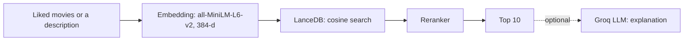

# Architecture

One flow: movies the user liked, or a description of what they want → embedding → LanceDB → rerank → top 10 → (optional) an LLM explains the picks.



## 1. Building the vector database (once, offline)

`notebooks/colab_pipeline.ipynb`, run once on Google Colab. The app never runs this step.

1. **Aggregate ratings.** Spark reads the 25M rows of `ratings.csv` and computes, per movie, the average rating and the number of ratings. Movies with fewer than 50 ratings are dropped. This is the only place Spark is used.
2. **Collect text.** pandas joins titles and genres, the 10 most relevant genome tags (relevance ≥ 0.8), the 5 most frequent user tags, and the overview and poster path fetched from the TMDB API.
3. **Build one text per movie**: `[Title] … [Genres] … [Overview] … [User Tags] … [Genome Tags] … [Quality] Rating: 4.1/5.0, 1234 votes.`
4. **Embed** each text with `all-MiniLM-L6-v2` (384 dimensions).
5. **Write a LanceDB table** `movies` with a fixed-size vector column and an IVF-PQ index (cosine, 256 partitions, 16 sub-vectors), zip it and upload it to Cloudflare R2 as `lancedb_movies.zip`.

Table columns: `movieId`, `title`, `genres`, `overview`, `poster_path`, `avg_rating`, `rating_count`, `vector`.

Because the index is approximate (IVF-PQ), a search returns near neighbours, not guaranteed exact ones.

## 2. Serving (`app.py`, `src/serving/`)

The Streamlit app runs on a Hugging Face Space. On a cold start it downloads `lancedb_movies.zip` from R2, unpacks it and opens it with the embedded LanceDB library; there is no database server.

**Query vector**

- From liked movies: the weighted average of their vectors (weights = ratings; the app uses 5.0 for every pick), normalised to unit length (`get_user_vector`).
- From a description: the text is embedded with the same model (`search_by_description`).

**Retrieval and reranking** (`semantic_search.py`)

LanceDB returns the nearest candidates by cosine distance (twice as many as will be shown). The reranker then scores each candidate:

```
final = 0.6 × similarity + 0.3 × popularity + 0.1 × quality
```

- similarity = 1 − cosine distance
- popularity = `rating_count` divided by the largest `rating_count` among the candidates
- quality = `avg_rating` / 5

The weights trade relevance against popularity: a higher popularity weight favours well-known movies and shrinks the share of niche ones.

Note that the rating and vote count are also written into the embedded text (step 3 above), so the quality signal enters twice: once through the embedding and once through the reranker.

**Chat** (`chatbot.py`)

Each user message is first used as a search query; the top 3 movies are put into the system prompt as context. The Groq-hosted model (`llama-3.3-70b-versatile`) can also call three tools:

| Tool | What it does |
| --- | --- |
| `search_movies_by_description` | Semantic search from a description |
| `get_recommendations` | Movies similar to a given title |
| `get_trending_by_rating` | Highly rated movies above a rating and vote threshold |

If Groq answers with a rate-limit error, the app falls back to a plain vector-search answer without the LLM.

## 3. Environment variables

| Variable | Used for |
| --- | --- |
| `AWS_ENDPOINT_URL`, `AWS_ACCESS_KEY_ID`, `AWS_SECRET_ACCESS_KEY` | Cloudflare R2 (S3-compatible) |
| `S3_BUCKET_NAME` | Bucket holding `lancedb_movies.zip` (default `movie-mlops`) |
| `GROQ_API_KEY`, or `GROQ_API_KEY_1` … `GROQ_API_KEY_5` | Groq chat model |
